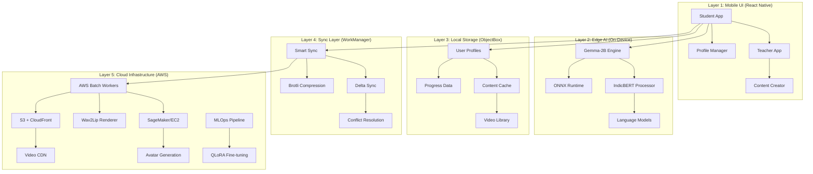
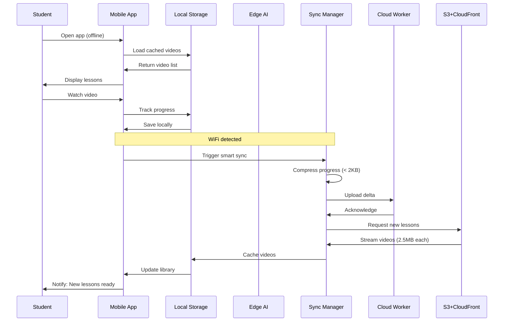
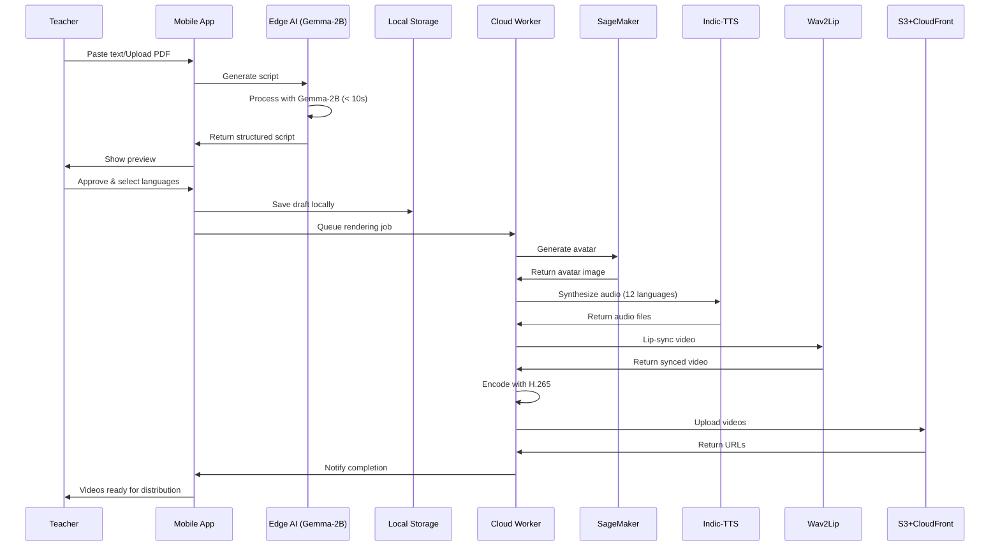

# BharatVidya Design Document: Offline-First, Indic-First, Frictionless

## 1. Design Philosophy & Vision

### 1.1 Core Design Philosophy

**"Offline-First, Indic-First, and Frictionless"**

BharatVidya is designed as a distributed system that transforms rural education in India through AI-powered video generation. The design philosophy centers on three pillars:

1. **Offline-First**: Every feature works without internet connectivity after initial 45MB installation
2. **Indic-First**: Cultural context, regional languages, and local learning patterns drive all design decisions
3. **Frictionless**: Zero technical barriers for students and teachers with minimal digital literacy

### 1.2 Design Mission

Transform rural education by converting text (NCERT, Wikipedia) into 2-minute regional language video lessons that work on 2GB RAM devices with 2G connectivity, at 33x lower cost than competitors (₹89/year vs ₹3,000+).

### 1.3 Target User Context

**Rural Students:**
- 2GB RAM Android devices (Snapdragon 4xx series)
- Intermittent 2G/3G connectivity
- Shared family devices (2-3 users per phone)
- Limited data budgets (< 1GB/month)
- Prefer regional language content

**Rural Teachers:**
- Limited technical skills
- Need to create video content quickly
- Work with intermittent connectivity
- Require analytics despite network issues

## 2. Visual Identity & Branding

### 2.1 Brand Theme

**Core Theme:** "Transforming Rural Education Through Offline-First AI"

**Brand Promise:** Empowering every rural student with quality education, regardless of connectivity or device limitations.

### 2.2 Mascot-Driven Approach

**Mascot: "Vidya" - The Learning Companion**

- **Character Design**: Friendly robot wearing traditional Indian attire (turban, dhoti)
- **Purpose**: Bridge advanced technology with cultural familiarity
- **Personality**: Helpful, patient, encouraging, culturally aware
- **Usage**: Onboarding, tutorials, error states, achievement celebrations

**Visual Representation:**
```
     ___
    /   \    <- Turban (regional colors)
   | ^_^ |   <- Friendly face
    \___/
     |||     <- Traditional attire
    /| |\    <- Welcoming gesture
```

### 2.3 Logo & Iconography

**Primary Logo:**
- Combines book icon with network signal bars (showing offline capability)
- Regional language script integration
- Colors: Saffron (#FF9933), White (#FFFFFF), Green (#138808) - Indian flag inspired

**Icon System:**
- **Offline Mode**: Solid icons with no network dependency indicators
- **Sync Status**: Animated icons showing data flow
- **Language Selector**: Regional script previews
- **Profile Switcher**: Avatar-based quick access

### 2.4 Brand Values

1. **Accessibility**: Works on any device, any network condition
2. **Cultural Diversity**: Celebrates India's linguistic and cultural richness
3. **Empowerment**: Enables teachers and students to create and learn
4. **Trust**: Transparent data usage, privacy-first design
5. **Affordability**: 33x cheaper than competitors

### 2.5 Color Palette

**Primary Colors:**
- **Bharat Saffron** (#FF9933): Action buttons, highlights
- **India Green** (#138808): Success states, completion indicators
- **Pure White** (#FFFFFF): Backgrounds, content areas

**Secondary Colors:**
- **Deep Blue** (#003366): Text, headers
- **Warm Gray** (#F5F5F5): Backgrounds, disabled states
- **Alert Red** (#D32F2F): Errors, warnings
- **Sunshine Yellow** (#FFC107): Tips, notifications

**Accessibility:**
- All color combinations meet WCAG AA standards (4.5:1 contrast ratio)
- High-contrast mode available for low-light conditions
- Color-blind friendly palette

## 3. UI/UX Principles for Rural Demographics

### 3.1 Connectivity Awareness Design

**Zero Signal UI States:**


1. **Offline Mode (Default State)**
   - Green indicator: "Working Offline"
   - All features fully functional
   - Cached content clearly marked
   - Queue indicator for pending syncs

2. **Limited Connectivity (2G/3G)**
   - Yellow indicator: "Limited Connection"
   - Essential syncs only (< 2KB progress updates)
   - Defer large downloads
   - Show estimated data usage

3. **Full Connectivity (WiFi/4G)**
   - Blue indicator: "Connected"
   - Auto-sync enabled
   - Background downloads active
   - Show sync progress

4. **Sync Failed State**
   - Red indicator: "Sync Pending"
   - Retry options
   - Manual sync trigger
   - Data saved locally

**Design Pattern:**
```
┌─────────────────────────────┐
│ ● Offline | 3 lessons cached│  <- Always visible status bar
├─────────────────────────────┤
│                             │
│   [Content Area]            │
│                             │
│   ✓ Fully functional        │
│   ✓ No network needed       │
│                             │
└─────────────────────────────┘
```

### 3.2 Shared Device Optimization

**Instant Profile Switching:**

**Design Requirements:**
- Switch profiles in < 3 seconds
- No login friction (PIN/biometric only)
- Visual profile indicators
- Isolated user data

**UI Pattern:**
```
┌─────────────────────────────┐
│  [👤 Ravi] [👧 Priya] [👨 Papa] │  <- Profile switcher (always visible)
├─────────────────────────────┤
│                             │
│   Current User: Ravi        │
│   Progress: 12/20 lessons   │
│                             │
│   [Switch Profile]          │
│                             │
└─────────────────────────────┘
```

**Profile Creation Flow:**
1. Tap "Add Profile"
2. Enter name + select avatar
3. Set PIN (4 digits) or biometric
4. Done - no email/phone required

### 3.3 Low-End Device Optimization

**Performance Design Principles:**

1. **Lazy Loading**
   - Load UI components on-demand
   - Defer non-critical assets
   - Progressive image loading

2. **Memory Management**
   - Maximum 3 screens in memory
   - Aggressive garbage collection
   - Compressed image assets

3. **Animation Budget**
   - 30fps minimum (not 60fps)
   - Simple transitions only
   - Disable animations on low-end devices

4. **Asset Optimization**
   - WebP images (30% smaller than PNG)
   - Vector icons (SVG)
   - Compressed fonts

### 3.4 Language Support Design

**12+ Regional Languages:**


- Hindi, English, Tamil, Telugu, Marathi, Bengali, Gujarati, Kannada, Malayalam, Odia, Punjabi, Assamese

**Language Selector Design:**
```
┌─────────────────────────────┐
│  Select Your Language       │
├─────────────────────────────┤
│  🇮🇳 हिंदी (Hindi)          │
│  🇮🇳 English                 │
│  🇮🇳 தமிழ் (Tamil)           │
│  🇮🇳 తెలుగు (Telugu)         │
│  🇮🇳 मराठी (Marathi)         │
│  ... [Show More]            │
└─────────────────────────────┘
```

**Text Rendering:**
- Native font support for all Indic scripts
- Fallback fonts for unsupported characters
- Right-to-left (RTL) support where needed
- Dynamic font sizing based on script complexity

### 3.5 Accessibility Features

**WCAG 2.1 AA Compliance:**
- Screen reader support (TalkBack)
- High-contrast mode
- Adjustable font sizes (100% - 200%)
- Touch target minimum 48x48dp
- Keyboard navigation support

**Rural-Specific Accessibility:**
- Voice commands in regional languages
- Simplified navigation (max 3 taps to any feature)
- Visual feedback for all actions
- Offline help documentation

## 4. Detailed User Flow Design: 24-Hour Learning Cycle

### 4.1 Morning (6:00 AM): Offline Video Playback

**Context:** Student wakes up, opens app on weak 2G signal

**UI Design:**
```
┌─────────────────────────────┐
│ ● Offline | Good Morning! 🌅│
├─────────────────────────────┤
│                             │
│  📚 Continue Learning        │
│                             │
│  ▶ Chapter 5: Photosynthesis│
│     Progress: 60% complete  │
│     [Continue Watching]     │
│                             │
│  📋 Today's Lessons (3)     │
│  ✓ Lesson 1 - Cached        │
│  ✓ Lesson 2 - Cached        │
│  ✓ Lesson 3 - Cached        │
│                             │
└─────────────────────────────┘
```

**Video Player Design:**
- High-contrast controls for outdoor viewing
- Large play/pause buttons (60x60dp)
- Brightness auto-adjust
- Subtitle support (regional languages)
- Playback speed control (0.75x, 1x, 1.25x, 1.5x)

**Offline Indicators:**
- "Downloaded" badge on cached videos
- Storage usage indicator
- Estimated watch time available

### 4.2 School (12:00 PM): Smart Sync Dashboard

**Context:** Student arrives at school, connects to WiFi

**UI Design:**
```
┌─────────────────────────────┐
│ ● Connected | WiFi Detected 📶│
├─────────────────────────────┤
│                             │
│  🔄 Smart Sync Active       │
│                             │
│  ✓ Progress synced (2KB)    │
│  ⬇ Downloading 5 lessons... │
│     2.5MB / 12.5MB          │
│     [████░░░░░░] 40%        │
│                             │
│  Next Lessons:              │
│  • Chapter 6: Respiration   │
│  • Chapter 7: Nutrition     │
│  • Quiz: Biology Basics     │
│                             │
│  [Pause Sync] [Settings]    │
└─────────────────────────────┘
```

**Smart Sync Features:**
- Auto-detect free WiFi
- Prioritize essential content
- Show data usage in real-time
- Pause/resume capability
- Background sync when app closed

### 4.3 Evening (6:00 PM): Offline Quiz Module

**Context:** Student takes quiz at home, no connectivity

**UI Design:**
```
┌─────────────────────────────┐
│ ● Offline | Quiz Time 📝    │
├─────────────────────────────┤
│                             │
│  Biology Quiz - Chapter 5   │
│  Question 3 of 10           │
│                             │
│  What is photosynthesis?    │
│                             │
│  ○ A. Process of respiration│
│  ● B. Process of making food│
│  ○ C. Process of digestion  │
│  ○ D. Process of excretion  │
│                             │
│  [Previous] [Next]          │
│                             │
│  💾 Saved locally           │
└─────────────────────────────┘
```

**Quiz Features:**
- Instant feedback (offline)
- Progress saved locally (ObjectBox)
- Retry unlimited times
- Detailed explanations
- Sync results when online

### 4.4 Night (2:00 AM): Background Sync Window

**Context:** Device charging, WiFi connected, user asleep

**Background Process (No UI):**
- WorkManager triggers sync
- Upload quiz results
- Download tomorrow's lessons
- Backup user data
- Update analytics

**Morning Notification:**
```
┌─────────────────────────────┐
│  BharatVidya                │
│  ✓ 5 new lessons ready!     │
│  ✓ Your progress backed up  │
│  Tap to start learning →    │
└─────────────────────────────┘
```

## 5. Technical Component Design

### 5.1 Edge AI Integration Design

**On-Device Inference UI:**


**Gemma-2B Script Generation:**
```
┌─────────────────────────────┐
│  AI Content Creator 🤖      │
├─────────────────────────────┤
│                             │
│  Paste your text or upload  │
│  PDF (NCERT/Wikipedia)      │
│                             │
│  [Text Input Area]          │
│  ┌─────────────────────┐   │
│  │ Photosynthesis is...│   │
│  │                     │   │
│  └─────────────────────┘   │
│                             │
│  🧠 AI Processing...        │
│  [████████░░] 80%           │
│  Generating script...       │
│                             │
└─────────────────────────────┘
```

**Design Principles:**
- Show processing progress
- Estimated time remaining
- Cancel option
- Offline processing indicator

**Performance Targets:**
- Script generation: < 10 seconds
- Memory usage: < 300MB
- Battery impact: Minimal (< 5% per generation)

### 5.2 Multimedia Interface Design

#### 5.2.1 Avatar UI Design

**AI-Generated Avatar Selection:**
```
┌─────────────────────────────┐
│  Choose Your Teacher Avatar │
├─────────────────────────────┤
│                             │
│  👨‍🏫 Male Teacher (Hindi)    │
│  👩‍🏫 Female Teacher (Tamil)  │
│  👨‍🎓 Young Tutor (English)   │
│  👩‍🎓 Senior Prof (Telugu)    │
│                             │
│  Voice Preview: [▶ Play]    │
│  Lip-sync: ✓ Enabled        │
│                             │
│  [Select Avatar]            │
└─────────────────────────────┘
```

**Avatar Features:**
- Natural Indic voices (Indic-TTS)
- 95%+ lip-sync accuracy (Wav2Lip)
- Cultural appropriate attire
- Regional accent support

#### 5.2.2 Video Player Design

**H.265 Adaptive Quality Player:**
```
┌─────────────────────────────┐
│  ◀ Chapter 5: Photosynthesis│
├─────────────────────────────┤
│                             │
│     [Video Player Area]     │
│     ┌─────────────────┐     │
│     │                 │     │
│     │   👨‍🏫 Avatar     │     │
│     │                 │     │
│     └─────────────────┘     │
│                             │
│  ▶ ⏸ ⏭ [━━━━━━━░░░] 70%    │
│  2:10 / 3:00                │
│                             │
│  Quality: Auto (360p)       │
│  Subtitles: हिंदी ✓         │
│  Speed: 1.0x                │
│                             │
└─────────────────────────────┘
```

**Player Features:**
- Adaptive bitrate (360p/480p/720p)
- Offline playback
- Subtitle support (12+ languages)
- Playback speed control
- Picture-in-picture mode
- Resume from last position

### 5.3 Teacher Content Creation Suite

**5-Minute Video Creator Workflow:**

#### Step 1: Content Input (2 minutes)
```
┌─────────────────────────────┐
│  Step 1: Add Your Content   │
├─────────────────────────────┤
│                             │
│  📄 Paste Text              │
│  [Text Input Area]          │
│                             │
│  OR                         │
│                             │
│  📁 Upload PDF              │
│  [Choose File]              │
│                             │
│  Supported: NCERT, Wikipedia│
│  Max size: 5MB              │
│                             │
│  [Next Step →]              │
└─────────────────────────────┘
```

#### Step 2: AI Scene Design (3 minutes)
```
┌─────────────────────────────┐
│  Step 2: AI Processing 🤖   │
├─────────────────────────────┤
│                             │
│  ✓ Script generated         │
│  ✓ Scenes designed          │
│  ⏳ Generating visuals...    │
│     [████████░░] 80%        │
│                             │
│  Preview:                   │
│  ┌─────────────────────┐   │
│  │ Scene 1: Intro      │   │
│  │ Scene 2: Concept    │   │
│  │ Scene 3: Example    │   │
│  └─────────────────────┘   │
│                             │
│  [Edit] [Next Step →]       │
└─────────────────────────────┘
```

#### Step 3: Auto-Translate & Publish (1 minute)
```
┌─────────────────────────────┐
│  Step 3: Publish Video      │
├─────────────────────────────┤
│                             │
│  Select Languages:          │
│  ☑ Hindi                    │
│  ☑ English                  │
│  ☑ Tamil                    │
│  ☐ Telugu                   │
│  [Select All]               │
│                             │
│  Avatar: 👨‍🏫 Male Teacher   │
│  Voice: Natural Hindi       │
│  Duration: ~2:30 min        │
│                             │
│  [Generate Videos]          │
│                             │
│  ⏱ Est. time: 5-10 minutes │
└─────────────────────────────┘
```

**Teacher Dashboard:**
```
┌─────────────────────────────┐
│  My Content Library 📚      │
├─────────────────────────────┤
│                             │
│  📊 Analytics               │
│  • 45 videos created        │
│  • 230 students reached     │
│  • 85% completion rate      │
│                             │
│  Recent Videos:             │
│  ✓ Photosynthesis (Hindi)   │
│     120 views | 4.8★        │
│  ✓ Respiration (Tamil)      │
│     95 views | 4.6★         │
│                             │
│  [+ Create New Video]       │
└─────────────────────────────┘
```

## 6. System Interaction Patterns (5-Layer Architecture)

### 6.1 Architecture Overview



### 6.2 Layer 1: Mobile UI Layer (React Native)

**Component Architecture:**


**Student App Components:**
```typescript
// Core UI Components
StudentApp/
├── screens/
│   ├── HomeScreen.tsx          // Dashboard with offline status
│   ├── VideoPlayerScreen.tsx   // H.265 adaptive player
│   ├── QuizScreen.tsx          // Offline quiz module
│   ├── ProfileScreen.tsx       // User profile & settings
│   └── LibraryScreen.tsx       // Content library
├── components/
│   ├── ConnectivityBanner.tsx  // Network status indicator
│   ├── ProfileSwitcher.tsx     // Instant profile switching
│   ├── SyncProgress.tsx        // Smart sync dashboard
│   ├── VideoCard.tsx           // Video thumbnail with cache status
│   └── LanguageSelector.tsx    // 12+ language support
└── navigation/
    └── AppNavigator.tsx        // Bottom tab navigation
```

**Teacher App Components:**
```typescript
TeacherApp/
├── screens/
│   ├── ContentCreatorScreen.tsx    // 5-minute video creator
│   ├── AnalyticsScreen.tsx         // Student progress tracking
│   ├── LibraryScreen.tsx           // Content management
│   └── SettingsScreen.tsx          // App configuration
├── components/
│   ├── TextInputEditor.tsx         // PDF/text input
│   ├── AIProcessingIndicator.tsx   // Gemma-2B progress
│   ├── AvatarSelector.tsx          // Avatar & voice selection
│   ├── LanguageMultiSelect.tsx     // Multi-language translation
│   └── AnalyticsDashboard.tsx      // Student metrics
└── workflows/
    └── VideoCreationFlow.tsx       // 3-step wizard
```

**Design Patterns:**
- **Atomic Design**: Atoms → Molecules → Organisms → Templates → Pages
- **Offline-First State Management**: Redux with offline persistence
- **Lazy Loading**: Code splitting for faster initial load
- **Error Boundaries**: Graceful error handling

### 6.3 Layer 2: Edge AI Layer (On-Device Processing)

**Gemma-2B Integration:**

```typescript
// Edge AI Service
class EdgeAIService {
  private gemmaModel: GemmaModel;
  private indicBERT: IndicBERTModel;
  
  async generateScript(text: string, language: string): Promise<Script> {
    // 4-bit quantized model (300MB footprint)
    const script = await this.gemmaModel.generate({
      input: text,
      maxTokens: 500,
      temperature: 0.7,
      language: language
    });
    
    return this.structureScript(script);
  }
  
  async processIndicLanguage(text: string): Promise<ProcessedText> {
    // IndicBERT for regional language understanding
    return await this.indicBERT.process(text);
  }
}
```

**Performance Optimization:**
- **Quantization**: 4-bit integer quantization (75% size reduction)
- **LoRA Fine-tuning**: Domain-specific educational content
- **Batch Processing**: Group multiple requests
- **Thermal Management**: Throttle at 45°C

**UI Integration:**
```typescript
// AI Processing Component
const AIProcessingIndicator = ({ progress, stage }) => (
  <View style={styles.container}>
    <Mascot animation="thinking" />
    <Text>🧠 {stage}</Text>
    <ProgressBar progress={progress} />
    <Text>{Math.round(progress * 100)}% complete</Text>
    <Text>Est. time: {estimateTime(progress)}s</Text>
  </View>
);
```

### 6.4 Layer 3: Local Storage Layer (ObjectBox)

**Data Models:**

```typescript
// ObjectBox Entities
@Entity()
class UserProfile {
  @Id() id: number;
  name: string;
  avatar: string;
  language: string;
  pinHash: string;
  createdAt: Date;
  lastActive: Date;
}

@Entity()
class CachedVideo {
  @Id() id: number;
  videoId: string;
  title: string;
  language: string;
  filePath: string;
  fileSize: number;
  duration: number;
  thumbnailPath: string;
  downloadedAt: Date;
  lastWatched?: Date;
  watchProgress: number; // 0-100
}

@Entity()
class ProgressData {
  @Id() id: number;
  userId: number;
  videoId: string;
  completed: boolean;
  watchTime: number;
  quizScore?: number;
  syncStatus: 'local' | 'syncing' | 'synced';
  lastModified: Date;
}

@Entity()
class SyncQueue {
  @Id() id: number;
  operation: 'upload' | 'download';
  dataType: 'progress' | 'video' | 'quiz';
  payload: string; // JSON serialized
  priority: number;
  retryCount: number;
  createdAt: Date;
}
```

**Storage Manager:**
```typescript
class StorageManager {
  private objectBox: ObjectBoxStore;
  
  async cacheVideo(video: Video): Promise<void> {
    // Store video with metadata
    await this.objectBox.put(CachedVideo, {
      videoId: video.id,
      filePath: await this.downloadVideo(video.url),
      ...video
    });
  }
  
  async getUserProgress(userId: number): Promise<ProgressData[]> {
    // Query with offline-first approach
    return await this.objectBox
      .box(ProgressData)
      .query(ProgressData_.userId.equals(userId))
      .build()
      .find();
  }
  
  async queueSync(operation: SyncOperation): Promise<void> {
    // Add to sync queue for later processing
    await this.objectBox.put(SyncQueue, operation);
  }
}
```

### 6.5 Layer 4: Sync Layer (WorkManager)

**Smart Sync Architecture:**

```typescript
// WorkManager Sync Service
class SmartSyncService {
  private workManager: WorkManager;
  private compressionEngine: BrotliCompressor;
  
  async scheduleSync(constraints: SyncConstraints): Promise<void> {
    // Constraint-aware scheduling
    const workRequest = new PeriodicWorkRequest.Builder(
      SyncWorker.class,
      15, // minutes
      TimeUnit.MINUTES
    )
      .setConstraints(
        new Constraints.Builder()
          .setRequiredNetworkType(constraints.networkType) // WiFi preferred
          .setRequiresBatteryNotLow(true) // Battery > 20%
          .setRequiresCharging(constraints.requiresCharging) // Optional
          .build()
      )
      .setBackoffCriteria(
        BackoffPolicy.EXPONENTIAL,
        WorkRequest.MIN_BACKOFF_MILLIS,
        TimeUnit.MILLISECONDS
      )
      .build();
    
    this.workManager.enqueue(workRequest);
  }
  
  async performDeltaSync(userId: number): Promise<SyncResult> {
    // Delta sync: only changed data
    const localData = await this.getLocalChanges(userId);
    const remoteData = await this.getRemoteChanges(userId);
    
    const delta = this.computeDelta(localData, remoteData);
    const compressed = await this.compressionEngine.compress(delta);
    
    // Target: < 2KB per sync
    if (compressed.size > 2048) {
      console.warn('Sync payload exceeds 2KB target');
    }
    
    return await this.uploadDelta(compressed);
  }
}
```

**Sync UI Feedback:**
```typescript
const SyncStatusBanner = ({ syncState }) => {
  const getStatusConfig = () => {
    switch (syncState.status) {
      case 'offline':
        return { color: 'green', icon: '●', text: 'Working Offline' };
      case 'syncing':
        return { color: 'blue', icon: '⟳', text: 'Syncing...' };
      case 'synced':
        return { color: 'green', icon: '✓', text: 'All synced' };
      case 'failed':
        return { color: 'red', icon: '!', text: 'Sync pending' };
    }
  };
  
  const config = getStatusConfig();
  
  return (
    <Banner backgroundColor={config.color}>
      <Icon>{config.icon}</Icon>
      <Text>{config.text}</Text>
      {syncState.dataUsage && (
        <Text>Data used: {formatBytes(syncState.dataUsage)}</Text>
      )}
    </Banner>
  );
};
```

### 6.6 Layer 5: Cloud Infrastructure (AWS)

**AWS Batch Video Rendering:**

```python
# Cloud Worker for Video Generation
class VideoRenderingWorker:
    def __init__(self):
        self.sagemaker_client = boto3.client('sagemaker')
        self.wav2lip_model = Wav2LipModel()
        self.indic_tts = IndicTTSEngine()
        self.h265_encoder = H265Encoder()
    
    async def render_video(self, job: RenderJob) -> str:
        # Step 1: Generate avatar (SageMaker/EC2)
        avatar = await self.generate_avatar(job.avatar_config)
        
        # Step 2: Generate audio (Indic-TTS)
        audio = await self.indic_tts.synthesize(
            text=job.script,
            language=job.language,
            voice=job.voice_config
        )
        
        # Step 3: Lip-sync (Wav2Lip)
        video = await self.wav2lip_model.generate(
            face_image=avatar,
            audio_file=audio,
            quality='high'
        )
        
        # Step 4: Encode (H.265)
        encoded_video = await self.h265_encoder.encode(
            video=video,
            bitrate='adaptive',
            resolution='720p'
        )
        
        # Step 5: Upload to S3
        s3_url = await self.upload_to_s3(encoded_video)
        
        # Step 6: Invalidate CloudFront cache
        await self.invalidate_cdn_cache(s3_url)
        
        return s3_url
```

**MLOps Pipeline (QLoRA Fine-tuning):**

```python
# Continuous Model Improvement
class MLOpsPipeline:
    def __init__(self):
        self.mlflow_client = mlflow.tracking.MlflowClient()
        self.model_registry = ModelRegistry()
    
    async def fine_tune_model(self, training_data: Dataset):
        # QLoRA fine-tuning for educational content
        with mlflow.start_run():
            # Log parameters
            mlflow.log_param("model", "gemma-2b")
            mlflow.log_param("quantization", "4-bit")
            mlflow.log_param("lora_rank", 8)
            
            # Fine-tune with LoRA
            fine_tuned_model = await self.train_with_qlora(
                base_model="gemma-2b",
                training_data=training_data,
                lora_config={
                    "r": 8,
                    "lora_alpha": 16,
                    "target_modules": ["q_proj", "v_proj"],
                    "lora_dropout": 0.05
                }
            )
            
            # Evaluate on test set
            metrics = await self.evaluate_model(fine_tuned_model)
            mlflow.log_metrics(metrics)
            
            # Register model if improved
            if metrics['accuracy'] > self.current_best_accuracy:
                mlflow.register_model(
                    f"runs:/{mlflow.active_run().info.run_id}/model",
                    "gemma-2b-educational"
                )
    
    async def deploy_model(self, model_version: str):
        # A/B testing deployment
        await self.model_registry.deploy(
            model_version=model_version,
            deployment_config={
                "strategy": "canary",
                "traffic_split": {"v1": 90, "v2": 10},
                "rollback_on_error": True
            }
        )
```

## 7. Data Flow Diagrams

### 7.1 Student Learning Flow



### 7.2 Teacher Content Creation Flow



## 8. Responsive Design & Screen Sizes

### 8.1 Target Devices

**Primary Devices (80% of rural market):**
- Screen sizes: 5.5" - 6.5"
- Resolution: 720x1280 (HD) to 1080x1920 (FHD)
- Aspect ratio: 16:9, 18:9, 19:9

**Design Breakpoints:**
```typescript
const breakpoints = {
  small: 320,   // 5" screens
  medium: 375,  // 5.5" screens
  large: 414,   // 6" screens
  xlarge: 480   // 6.5"+ screens
};
```

### 8.2 Adaptive Layouts

**Portrait Mode (Primary):**
```
┌─────────────────┐
│   Status Bar    │ 24dp
├─────────────────┤
│  Connectivity   │ 48dp
├─────────────────┤
│                 │
│   Content       │
│   Area          │
│   (Scrollable)  │
│                 │
│                 │
├─────────────────┤
│  Bottom Nav     │ 56dp
└─────────────────┘
```

**Landscape Mode (Video Playback):**
```
┌───────────────────────────────┐
│                               │
│     Full-Screen Video         │
│     Player                    │
│                               │
└───────────────────────────────┘
```

## 9. Performance Optimization Strategies

### 9.1 App Size Optimization

**Initial Install: 45MB Target**
- Base APK: 25MB
- Essential assets: 10MB
- Cached content: 10MB

**Techniques:**
- Code splitting (React Native)
- Asset compression (WebP, SVG)
- ProGuard/R8 optimization
- Remove unused dependencies

### 9.2 Memory Management

**2GB RAM Budget:**
- System: 800MB
- Other apps: 400MB
- BharatVidya: 600MB max
  - UI: 150MB
  - Edge AI: 300MB
  - Cache: 150MB

**Optimization:**
- Aggressive garbage collection
- Image recycling
- Video buffer management
- Profile-based memory limits

### 9.3 Battery Optimization

**Power Consumption Targets:**
- Video playback: 5% per hour
- AI processing: 3% per generation
- Background sync: 1% per sync

**Techniques:**
- Doze mode compatibility
- WorkManager constraints
- Efficient network usage
- CPU throttling

## 10. Accessibility & Inclusivity

### 10.1 Visual Accessibility

**High-Contrast Mode:**
- 7:1 contrast ratio (WCAG AAA)
- Bold text option
- Large touch targets (48x48dp minimum)

**Font Scaling:**
- Support 100% - 200% scaling
- Responsive layouts
- No text truncation

### 10.2 Audio Accessibility

**Screen Reader Support:**
- TalkBack compatibility
- Descriptive labels
- Navigation hints
- Content descriptions

**Subtitle Support:**
- 12+ languages
- Adjustable size/color
- Background opacity control

### 10.3 Motor Accessibility

**Touch Targets:**
- Minimum 48x48dp
- Adequate spacing (8dp)
- No precise gestures required

**Alternative Inputs:**
- Voice commands
- Keyboard navigation
- Switch access support

## 11. Error Handling & Edge Cases

### 11.1 Network Errors

**No Connectivity:**
- Show offline banner
- Enable all cached features
- Queue sync operations
- Clear messaging

**Slow Connectivity:**
- Show loading indicators
- Timeout after 30s
- Retry with exponential backoff
- Fallback to cached content

### 11.2 Storage Errors

**Low Storage:**
- Warning at 100MB free
- Auto-cleanup old cache
- Prioritize user content
- Suggest manual cleanup

**Storage Full:**
- Block new downloads
- Show storage manager
- Guide user to free space
- Maintain core functionality

### 11.3 AI Processing Errors

**Model Loading Failed:**
- Retry with cached model
- Fallback to simpler model
- Report to MLOps pipeline
- User-friendly error message

**Inference Timeout:**
- Cancel after 30s
- Offer retry option
- Suggest simpler input
- Log for debugging

## 12. Analytics & Monitoring

### 12.1 User Analytics

**Tracked Metrics:**
- Session duration
- Video completion rate
- Quiz performance
- Feature usage
- Crash reports

**Privacy-First:**
- No PII collection
- Aggregated data only
- User consent required
- DPDP Act 2023 compliant

### 12.2 Performance Monitoring

**Real-Time Metrics:**
- App startup time
- Video load time
- AI inference latency
- Sync success rate
- Memory usage

**Alerting:**
- Crash rate > 0.1%
- Sync failure > 1%
- Startup time > 5s
- Memory usage > 600MB

## 13. Future Enhancements

### 13.1 Phase 2 Features

- **Live Classes**: Real-time video streaming
- **Peer Learning**: Student collaboration tools
- **Gamification**: Badges, leaderboards, rewards
- **Parent Dashboard**: Progress monitoring
- **Offline Assessments**: Comprehensive testing

### 13.2 Advanced AI Features

- **Personalized Learning**: Adaptive content recommendations
- **Speech Recognition**: Voice-based interaction
- **Handwriting Recognition**: Digital note-taking
- **Auto-Grading**: AI-powered quiz evaluation

### 13.3 Platform Expansion

- **iOS Support**: iPhone/iPad compatibility
- **Web Platform**: Browser-based access
- **Smart TV**: Large-screen learning
- **Feature Phones**: USSD/SMS integration


